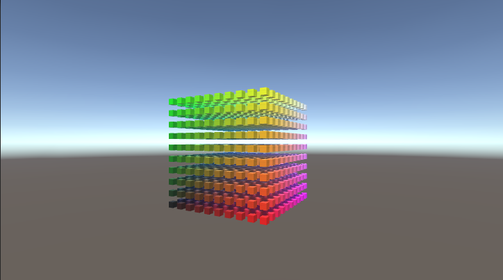
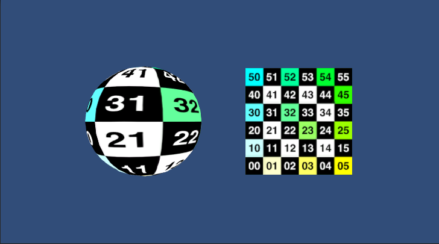
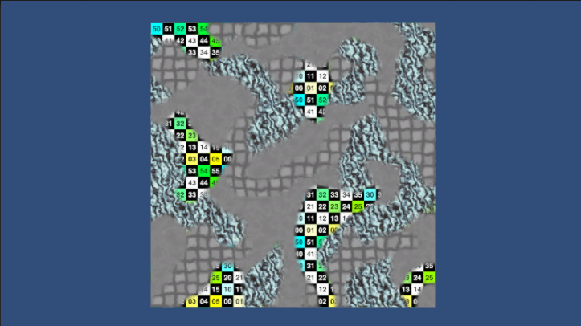
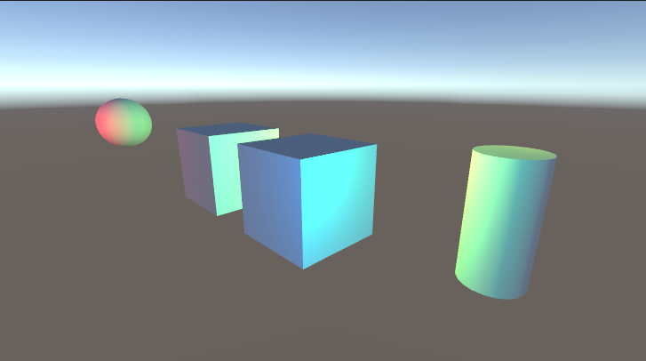
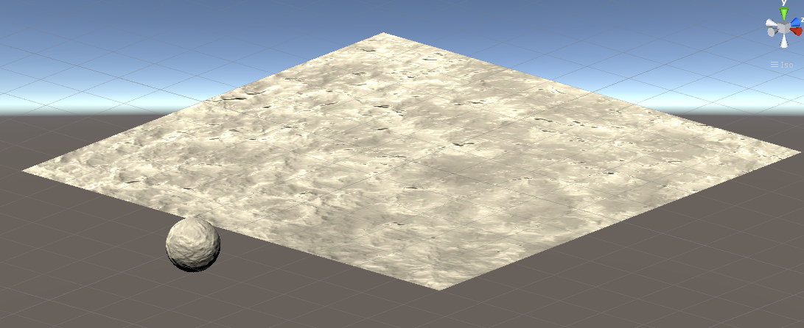

# Rendering Playground #

Some practice I thought I'd do regarding shaders. :)

### Covered so far ###
* Matrix Transformations
* Texturing
* Multi texturing
* Multiple lighting sources

| | | |
|:-------------------------:|:-------------------------:|:-------------------------:|
| |  | 
| || |
